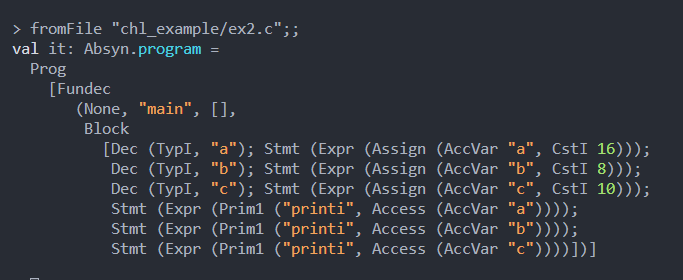
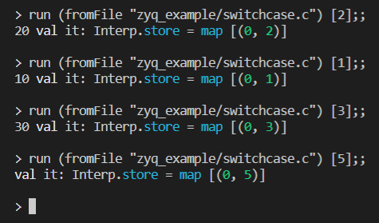

# 2021-2022学年第2学期

# **大 作 业 实 验 报 告**


- 课程名称：编程语言原理与编译
- 实验项目：期末大作业
- 专业班级：<u>计算1902、计算1902</u>
- 学生学号：<u>31901060、31901039</u>
- 学生姓名：<u>张亦骞、蔡海龙</u>
- 实验指导教师：郭鸣


## **实验内容**

### **零、翻译专业词汇标准**

​		翻译自《编译原理》——蒋宗礼、姜守旭。

```
BNF 巴科斯范式
CFG 上下文无关文法
CFL 上下文无关语言
CSG 上下文有关文法
CSL 上下文有关语言
DFA 确定的有穷状态自动机
FA 有穷状态自动机
FSC 有穷状态控制器
iff 当且仅当
Lex 一个词法分析器生成工具
LPP 最左素短语
NFA 不确定的有穷状态自动机
OG 算符文法
OPG 算符优先文法
PSG 短语结构文法
PSL 短语结构语言
r.e. 递归可枚举集或语言
RG 正则文法
RL 正则语言
Yacc 一个语法分析器生成工具
```


### **一、项目结构**

1、编译器：F#实现

```
Absyn.fs抽象语法树
CPar.fsy生成CPar.fs语法分析
CLex.fsl生成CLex.fs词法分析
Interp.fs解释器（解释器主文件）
interpc.fsproj解释器项目文件
```

2、编译器：F#实现

```
Comp.fs编译器（编译器主文件）
microc.fsproj编译器项目文件
```

3、虚拟机：C实现

```
machine.c汇编指令
Machine.fs汇编指令定义
```

4、测试代码

```
zyq_example
chl_example
common_example（该文件夹中的测试代码为原microc已实现的如if-else语句的测试代码）
```

5、运行截图

```
img文件夹
```


### **二、项目分工表格**

| 姓名   | 学号     | 班级     | 任务                                                         | 权重 |
| ------ | -------- | -------- | ------------------------------------------------------------ | ---- |
| 蔡海龙 | 31901039 | 计算1902 | 注释，数值常量，修改标识符定义，break初步，位移运算、逻辑运算，boolean类型 | 0.95 |
| 张亦骞 | 31901060 | 计算1902 | 自增自减，三目运算符，复合赋值运算符，变量初始化，if，for in 表达式，循环for/dowhile/dountil，switch-case，类型检查 | 0.95 |


### **三、成员代码提交日志**


### **四、项目自评等级（1-5）**

​		请根据自己项目情况填写下表。

|                        词法                        |   评分   |                             备注                             |
| :------------------------------------------------: | :------: | :----------------------------------------------------------: |
|                     注释 (* *)                     |    5     |                                                              |
|                     注释 /**/                      |    5     |                                                              |
|                      注释 //                       |    5     |                                                              |
|                字符串常量 单引号' '                |          |                                                              |
|                字符串常量 双引号 ""                |          |                                                              |
|               字符串常量 三引号 '''                |          |                                                              |
|               数值常量 二进制0b0101                |    5     |                                                              |
|                数值常量 八进制0o777                |    5     |                                                              |
|                数值常量 十六0xFFDA                 |    5     |                                                              |
|        修改标识符定义 类型名称：以大写开头         |          |                                                              |
|         修改标识符定义 变量名：以小写开头          |    5     |                                                              |
| 修改标识符定义  __不可作为变量名开头（遇到则报错） |    5     |                                                              |
|                                                    |          |                                                              |
|                      **语法**                      | **评分** |                           **备注**                           |
|         变量初始化（定义变量时同时赋初值）         |    3     |                    未实现全局变量的初始化                    |
|                    if的多种方式                    |    5     |    if ifelse ifelseif为microc自带。实现了不带else的if语句    |
|                    switch case                     |    3     |           只实现了普通的case，未实现default和break           |
|                      循环 for                      |    4     | 尝试实现初始化表达式为语句的for循环，但未能实现。实现了普通的for循环 |
|                     循环 while                     |    5     |                          microc自带                          |
|                   循环 do while                    |    5     |                                                              |
|                   循环 do until                    |    5     |                                                              |
|             三目运算 ? :      (C语言)              |    5     |                                                              |
|                   for in 表达式                    |    4     |      编译器部分暂时不能实现同时输出存在正序和逆序的情况      |
|         匿名 lambda 函数（参考Python或js）         |          |                                                              |
|       前置自增、前置自减、后置自增、后置自减       |    5     |                                                              |
|          复合赋值运算符+=  -=  *=  /=  %=          |    5     |                                                              |
|                       break                        |    3     |               会跳出循环但是会有报错，暂未解决               |
|                   左移<<、右移>>                   |    5     |                                                              |
|               与&、或\|、非~、异或^                |    5     |                                                              |
|                     print改进                      |    2     |                        支持%d输出int                         |
|                      max、min                      |    5     |                                                              |
|                                                    |          |                                                              |
|                    **变量类型**                    | **评分** |                           **备注**                           |
|                     float类型                      |          |                                                              |
|                     double类型                     |          |                                                              |
|                     string类型                     |          |                                                              |
|                    boolean类型                     |    4     |                       true=1，false=0                        |
|                                                    |          |                                                              |
|                      **语义**                      | **评分** |                           **备注**                           |
|                     动态作用域                     |          |                                                              |
|                     静态作用域                     |          |                                                              |
|                      类型检查                      |    1     | 尝试实现左值变量acc的类型检查失败，未能实现把类型检查放在命令行运行程序，目前是独立的代码段 |
|                  数组下标越界检查                  |    5     |                                                              |
|                      闭包支持                      |          |                                                              |
|                    模式匹配支持                    |          |                                                              |
|       中间代码生成 AST，四元式，三元式，llvm       |          |                                                              |
|              生成器 generator, yield               |          |                                                              |


### **五、功能实现步骤（以前置自增为例）**

#### **1、解释器部分**

（1）在Absyn.fs中定义抽象语法

```F#
and expr =                           // 表达式，右值                     
  | PreInc of access                                           //自增 ++i or ++a[e]
```

（2）在CPar.fsy中添加词元说明符token和该token的用法

​		添加词元说明符token：

```
//%token是词元说明符
...
%token PREINC           //前置自增
...
```

```F#
%right ASSIGN             /* 最低优先级 */  // 最下面的优先级最高
...
%left TIMES DIV MOD       //乘 除 取余
%nonassoc NOT AMP PREINC         //!取反 &取地址 前置自增
%nonassoc LBRACK          /* 最高优先级  */  //左括号

//这里要注意添加的关键字的优先级，优先级高的放下面，优先级低的放上面
```

​		添加用法：

```
  //非左值的情况
ExprNotAccess:
...
  | PREINC Access                       { PreInc $2      }  // 前置自增++a
...
;
```

（3）在CLex.fsl中添加该token

```F#
rule Token = parse          // 每个 规则rule 会生成为一个函数，函数名是规则名 Token
...
  | "++"            { PREINC }    //前置自增
...

//注意这里++是两个字符，所以要用双引号，不能用单引号
```

（4）在Interp.fs中添加该token的实现

```F#
and eval e locEnv gloEnv store : int * store =
    match e with
    ...
    | PreInc acc -> //前置自增
        let (loc, store1) as res = access acc locEnv gloEnv store //取要求的acc的地址和环境
        let res = getSto store1 loc //得到要求的这个acc在store1的loc位置上的值
        (res + 1, setSto store1 loc (res + 1)) //把值加一后set到store中，元组左边返回的就是这个加一后的值
    ...

```


#### **2、编译器部分**

（1）在Absyn.fs中定义抽象语法【即解释器部分的（1）】

（2）若需要添加汇编指令，在Machine.c中添加【前置自增未用到新的指令，故省略该步骤】

（3）在Comp.fs中添加相应的实现

```F#
//编译右值表达式
and cExpr (e: expr) (varEnv: VarEnv) (funEnv: FunEnv) : instr list =
    match e with
	...
	| PreInc acc -> cAccess acc varEnv funEnv @ [ DUP; LDI; CSTI 1; ADD; STI ]//前置自增
	...
```

---------------------------------------------------------------------------------------------------------

以下为涉及到新增汇编指令时的操作

（4）在machine.c中添加汇编指令

（5）在Machine.fs中添加汇编指令的定义


### **六、运行工程使用到的执行命令**

#### **1、解释器部分（12条命令）**

```sh
dotnet restore interpc.fsproj #可选
dotnet clean interpc.fsproj #可选
dotnet build interpc.fsproj #构建./bin/Debug/net6.0/interpc.exe，并查看详细生成过程
./bin/Debug/net6.0/interpc.exe zyq_example/preinc.c #查看运行结果
dotnet "C:\Users\82444\.nuget\packages\fslexyacc\10.2.0\build\/fslex/netcoreapp3.1\fslex.dll" -o "CLex.fs" --module CLex --unicode CLex.fsl #生成扫描器
dotnet "C:\Users\82444\.nuget\packages\fslexyacc\10.2.0\build\/fsyacc/netcoreapp3.1\fsyacc.dll" -o "CPar.fs" --module CPar CPar.fsy #生成分析器
dotnet fsi #进入命令行
					 #注：以下代码在终端的fsi中运行
#r "nuget: FsLexYacc";; //添加包引用
#load "Absyn.fs" "Debug.fs" "CPar.fs" "CLex.fs" "Parse.fs" "Interp.fs" "ParseAndRun.fs" ;;
open ParseAndRun;;
fromFile "chl_example/ex11.c";; #查看preinc.c语法树
run (fromFile "chl_example/ex11.c") [];; #解释执行preinc.c
```

#### **2、编译器部分（6条命令）**

```sh
gcc -o machine.exe machine.c #生成c虚拟机
dotnet restore microc.fsproj #可选
dotnet clean microc.fsproj #可选
dotnet build microc.fsproj #构建./bin/Debug/net6.0/microc.exe
dotnet run --project microc.fsproj zyq_example/preinc.c #查看运行结果
.\machine.exe -trace zyq_example/preinc.out 0 #追踪查看运行栈
```


### **七、项目说明**

#### **0-1、重要参考图片【非常重要】**


#### **0-2、项目概述**

​		本项目是基于现有的microc代码。


#### **1、实现 前置自增、前置自减、后置自增、后置自减**

1、Absyn.fs

```
and expr =                           // 表达式，右值
  | PreInc of access                             //前置自增 ++i or ++a[e]
  | PreDec of access                             //前置自减 --i or --a[e]
  | NextInc of access                            //后置自增 i++ or a[e]++
  | NextDec of access                            //后置自减 i-- or a[e]--
```

2、CPar.fsy

​		先定义token：

```
%token SELFINC SELFDEC           //自增 自减
```

​		然后根据优先级放在正确的位置：

```
%nonassoc NOT AMP SELFINC SELFDEC         //!取反 &取地址 自增 自减
```

​		然后定义token的规则：

```
//非左值的情况
ExprNotAccess:
  | SELFINC Access                      { PreInc $2       }     // 前置自增++a
  | SELFDEC Access                      { PreDec $2       }     // 前置自减--a
  | Access SELFINC                      { NextInc $1      }     // 后置自增a++
  | Access SELFDEC                      { NextDec $1      }     // 后置自减a--
```

3、CLex.fsl

```
rule Token = parse          // 每个 规则rule 会生成为一个函数，函数名是规则名 Token
  | "++"            { SELFINC }    //前置自增，后置自增
  | "--"            { SELFDEC }    //前置自减，后置自减
```

4、Interp.fs（解释器）

```
and eval e locEnv gloEnv store : int * store =
    | PreInc acc -> //前置自增
        let (loc, store1) as res = access acc locEnv gloEnv store //取要求的acc的地址和环境
        let res = getSto store1 loc //得到要求的这个acc在store1的loc位置上的值
        (res + 1, setSto store1 loc (res + 1)) //把值加一后set到store中，元组左边返回的就是这个加一后的值
    | PreDec acc -> //前置自减
        let (loc, store1) as res = access acc locEnv gloEnv store //取要求的acc的地址和环境
        let res = getSto store1 loc //得到要求的这个acc在store1的loc位置上的值
        (res - 1, setSto store1 loc (res - 1)) //把值减一后set到store中，元组左边返回的就是这个减一后的值
    | NextInc acc -> //后置自增
        let (loc, store1) as res = access acc locEnv gloEnv store //取要求的acc的地址和环境
        let res = getSto store1 loc //得到要求的这个acc在store1的loc位置上的值
        (res, setSto store1 loc (res + 1)) //把值加一后set到store中，元组左边返回的是加一前自身的值
    | NextDec acc -> //后置自减
        let (loc, store1) as res = access acc locEnv gloEnv store //取要求的acc的地址和环境
        let res = getSto store1 loc //得到要求的这个acc在store1的loc位置上的值
        (res, setSto store1 loc (res - 1)) //把值减一后set到store中，元组左边返回的是减一前自身的值
```

5、Comp.fs（编译器）

```
and cExpr (e: expr) (varEnv: VarEnv) (funEnv: FunEnv) : instr list = //参数：表达式e，变量环境varEnv，函数环境funEnv，返回汇编指令列表
    | PreInc acc ->
        cAccess acc varEnv funEnv @ [ DUP; LDI; CSTI 1; ADD; STI ]//前置自增
    | PreDec acc ->
        cAccess acc varEnv funEnv @ [ DUP; LDI; CSTI 1; SUB; STI ]//前置自减
    | NextInc acc ->
        cAccess acc varEnv funEnv @ [ DUP; LDI; SWAP; DUP; LDI; CSTI 1; ADD; STI ; INCSP -1]//后置自增
    | NextDec acc -> 
        cAccess acc varEnv funEnv @ [ DUP; LDI; SWAP; DUP; LDI; CSTI 1; SUB; STI ; INCSP -1]//后置自减
```

6、测试代码

```
//前置自增
void main() {
  int x;
  x = 3;
  print ++x;

  int a[3];
  a[0] = 1;
  a[1] = 2;
  a[2] = 3;
  print ++a[2];
}

//前置自减
void main() {
  int x;
  x = 3;
  print --x;
  
  int a[3];
  a[0] = 1;
  a[1] = 2;
  a[2] = 3;
  print --a[2];
}

//后置自增
void main() {
  int x;
  x = 3;
  print x++;
  
  int a[3];
  a[0] = 1;
  a[1] = 2;
  a[2] = 3;
  print a[2]++;
}

//后置自减
void main() {
  int x;
  x = 3;
  print x--;
  
  int a[3];
  a[0] = 1;
  a[1] = 2;
  a[2] = 3;
  print a[2]--;
}
```

7、查看语法树

前置自增：


前置自减：


后置自增：


后置自减：


8、解释运行

前置自增：


前置自减：


后置自增：


后置自减：


9、追踪查看运行栈

前置自增：


前置自减：


后置自增：


后置自减：


#### 2、实现 (* *)注释

1、CLex.fsl中添加如下代码

```fsharp
rule Token = parse
	| "(* "            { Comment lexbuf; Token lexbuf }
and Comment = parse
	| "(* "           { Comment lexbuf; Comment lexbuf }
   	| "*)"           { () }
```

2、运行命令

```shell
./bin/Debug/net6.0/interpc.exe .\chl_exampale\ex1.c
```

3、测试代码

```C
void main(){
    int x;
    x = 3;
    //print x
    x++;
    /*print x*/
    x++;
    (* faskdlfj*)
    print x;
}
```

4、运行结果


5、查看AST

```
dotnet run -p interpc.fsproj .\chl_exampale\ex1.c -g
```


#### **3、实现 二进制`0b`、八进制`0o`、十进制、十六进制`0x`数值常量**

1、CLex.fsl

```fsharp
// 2进制转换函数
let bin2Dec value=
    let rec binaryToList value n =
        match value%10 with
        | _ when value%10 >= 0 && value%10 < 2 -> if value=0 then n else binaryToList (value/10) ((value%10)::n)
        | _        -> failwith "Does not conform to binary number type."
    let rec pow n =
        if n=0 then 1
        else 2 * (pow (n-1))
    let rec len xs =
        match xs with
        | []-> 0
        | x::xr->1 + len xr
    let rec eval (n: int list) =
        match n with
        | [] -> 0
        | xr::yr -> xr * pow (len yr) + eval yr
    eval (binaryToList value [])
// 8进制转换函数
let oct2Dec value=
    let rec octalToList value n =
        match value%10 with
        | _ when value%10 >= 0 && value%10 < 8 -> if value=0 then n else octalToList (value/10) ((value%10)::n)
        | _        -> failwith "Does not conform to octal number type."
    let rec pow n =
        if n=0 then 1
        else 8 * (pow (n-1))
    let rec len xs =
        match xs with
        | []-> 0
        | x::xr->1 + len xr
    let rec eval (n: int list) =
        match n with
        | [] -> 0
        | xr::yr -> xr * pow (len yr) + eval yr
    eval (octalToList value [])
// 16进制转换函数
let hex2Dec value = 
    let rec hexaToList (str:string)  = 
        if(str.Length <= 0) then []
        else
            match str.[0] with
            | _ when str.[0] >='a' && str.[0] <= 'f'    -> (int str.[0]) - ( int 'a') + 10::hexaToList str.[1..str.Length - 1]
            | _ when str.[0] >= 'A' && str.[0] <= 'F'   -> (int str.[0]) - ( int 'A') + 10::hexaToList str.[1..str.Length - 1]
            | _ when str.[0] >= '0' && str.[0] <= '9'   -> (int str.[0]) - ( int '0') ::hexaToList str.[1..str.Length - 1]
            | _                                         -> failwith "Does not conform to hex number type."
    let result = hexaToList (value)
    let mutable num = 0;
    List.iter(fun i -> num <- num*16 + i)result
    num

let binHexOct (s:string) =
    match s.[0..1] with
    | "0B"
    | "0b"
    | "0O"
    | "0o"
    | "0X"
    | "0x" ->   s.[2..(s.Length)-1] 
    | _    ->   failwith "Lexer error: no such radix"
rule Token = parse    
    | "0"['B''b']['0'-'1']+                { CSTINT (bin2Dec(System.Int32.Parse (binHexOct (lexemeAsString lexbuf))))}    
  | "0"['O''o']['0'-'7']+                { CSTINT (oct2Dec(System.Int32.Parse (binHexOct (lexemeAsString lexbuf)))) }
  | "0"['X''x']['0'-'9''A'-'F''a'-'f']+  {CSTINT (hex2Dec(binHexOct (lexemeAsString lexbuf)))}  
```

2、测试代码

```
//16/8/2进制
void main(){
    int a;
    a=0x10;
    int b;
    b=0O10;
	int c;
    c=0b1010;

	print a;
	print b;
    print c;
}
```

3、执行结果


生成树



解释执行


#### **4、实现 三目运算符**

1、Absyn.fs

```
and expr =                           // 表达式，右值
  | TernaryOperator of expr * expr * expr        //三目运算符 ? :
```

2、CPar.fsy

​		首先定义token：

```
%token QUESMARK COLON //QUESMARK是问号 COLON是冒号
```

​		然后根据优先级放在指定位置：

```
%right MINUSASSIGN PLUSASSIGN MODASSIGN TIMESASSIGN DIVASSIGN //复合赋值运算符-= += %= *= /=
%right QUESMARK COLON     //问号 冒号                 高于复合赋值运算符，低于逻辑或
%left SEQOR               //逻辑或||
```

​		然后写token的规则：

```
//非左值的情况
ExprNotAccess:
  | Expr QUESMARK Expr COLON Expr       { TernaryOperator($1, $3, $5)} //三目运算符
```

3、CLex.fsl

```
rule Token = parse          // 每个 规则rule 会生成为一个函数，函数名是规则名 Token
  | '?'             { QUESMARK }    //问号【用于三目运算符】
  | ':'             { COLON }       //冒号【用于三目运算符】
```

4、Interp.fs（解释器）

```
and eval e locEnv gloEnv store : int * store =
    | TernaryOperator (e1, e2, e3) -> //三目运算符
        let (v, store1) = eval e1 locEnv gloEnv store //计算表达式e1的值
        if v <> 0 then //表达式e1不为0
            let (v2, store2) = eval e2 locEnv gloEnv store1//计算e2
            (v2,store2) //返回结果和store2
        else //表达式e1为0
            let (v2, store2) = eval e3 locEnv gloEnv store1//计算e3
            (v2,store2) //返回结果和store2
```

5、Comp.fs（编译器）

```
and cExpr (e: expr) (varEnv: VarEnv) (funEnv: FunEnv) : instr list = //参数：表达式e，变量环境varEnv，函数环境funEnv，返回汇编指令列表
    | TernaryOperator (e1,e2,e3) -> //三目运算符
        let labelse = newLabel () //生成else语句的标签
        let labend = newLabel () //生成end语句的标签
        
        cExpr e1 varEnv funEnv //计算e1表达式
        @ [ IFZERO labelse ] //如果表达式e等于0，跳到else标签
          @ cExpr e2 varEnv funEnv //编译e2表达式
            @ [ GOTO labend ] //跳转到end标签
              @ [ Label labelse ] //else标签开始的地方
                @ cExpr e3 varEnv funEnv @ [ Label labend ] //编译e3表达式，并连上end标签，编译结束
```

6、测试代码

```
//三元表达式
void main() {
  int x;
  x = 10;
  x == 5 ? print x : print (x * 2);
}
```

7、查看语法树


8、解释执行


9、追踪查看运行栈


#### **5、实现 复合赋值运算符**

1、Absyn.fs

```
and expr =                           // 表达式，右值
  | Prim3 of string * access * expr              //复合赋值运算符
```

2、CPar.fsy

​		首先定义token：

```
%token PLUSASSIGN MINUSASSIGN TIMESASSIGN DIVASSIGN MODASSIGN //复合赋值运算符+= -= *= /= %=
```

​		然后根据优先级放在指定位置：

```
%right MINUSASSIGN PLUSASSIGN MODASSIGN TIMESASSIGN DIVASSIGN //复合赋值运算符-= += %= *= /=
```

​		然后定义token的规则：

```
//非左值的情况
ExprNotAccess:
  | Access PLUSASSIGN Expr              { Prim3("+=", $1, $3) } // 表达式+=表达式 $1为左值
  | Access MINUSASSIGN Expr             { Prim3("-=", $1, $3) } // 表达式-=表达式 $1为左值
  | Access TIMESASSIGN Expr             { Prim3("*=", $1, $3) } // 表达式*=表达式 $1为左值
  | Access DIVASSIGN Expr               { Prim3("/=", $1, $3) } // 表达式/=表达式 $1为左值
  | Access MODASSIGN Expr               { Prim3("%=", $1, $3) } // 表达式%=表达式 $1为左值
;
```

3、CLex.fsl

```
rule Token = parse          // 每个 规则rule 会生成为一个函数，函数名是规则名 Token
  | "/="            { DIVASSIGN }   //复合赋值运算符/=
  | "*="            { TIMESASSIGN } //复合赋值运算符*=
  | "%="            { MODASSIGN }   //复合赋值运算符%=
  | "+="            { PLUSASSIGN }  //复合赋值运算符+=
  | "-="            { MINUSASSIGN } //复合赋值运算符-=
```

4、Interp.fs（解释器）

```
and eval e locEnv gloEnv store : int * store =
    | Prim3 (ope, acc, e) -> //复合赋值运算符
        let (loc, store1) = access acc locEnv gloEnv store //取要求的acc的地址和环境store1
        let v1=getSto store1 loc //得到acc地址上的值
        let (v2, store2) = eval e locEnv gloEnv store1 //计算表达式e的值，并得到新环境store2
        
        let res= //匹配五种复合赋值运算符，得到计算结果
            match ope with
            | "+=" -> v1 + v2
            | "-=" -> v1 - v2
            | "*=" -> v1 * v2
            | "/=" -> v1 / v2
            | "%=" -> v1 % v2
            | _ -> failwith ("unknown primitive " + ope)
        
        (res, setSto store2 loc res) //返回的store是把计算结果存到左值acc地址上后的新store
```

5、Comp.fs（编译器）

```
and cExpr (e: expr) (varEnv: VarEnv) (funEnv: FunEnv) : instr list = //参数：表达式e，变量环境varEnv，函数环境funEnv，返回汇编指令列表
    | Prim3 (ope, acc, e) -> //复合赋值运算符
        cAccess acc varEnv funEnv //计算左值acc
        @ [DUP] @ [LDI] //DUP:复制栈顶的acc地址，现在栈中有两个
                        //LDI:取出栈顶的这个acc地址的值
          @ cExpr e varEnv funEnv //计算e表达式
            @ (match ope with //匹配操作符
              | "+=" -> [ ADD ] @ [STI] //栈顶acc的值+表达式e的结果，然后写入栈顶进行赋值，即set s[s[sp-1]]
              | "-=" -> [ SUB ] @ [STI]
              | "*=" -> [ MUL ] @ [STI]
              | "/=" -> [ DIV ] @ [STI]
              | "%=" -> [ MOD ] @ [STI]
              | _ -> raise (Failure "unknown primitive 3"))
```

6、测试代码

```
//复合赋值运算符
void main() {
  int x;
  x=5;
  print x;
  x+=1;
  print x;

  int y;
  y=5;
  print y;
  y-=1;
  print y;

  int z;
  z=5;
  print z;
  z*=2;
  print z;

  int w;
  w=5;
  print w;
  w/=2;
  print w;

  int t;
  t=5;
  print t;
  t%=3;
  print t;
}
```

7、查看语法树


8、解释执行


9、追踪查看运行栈


#### **6、实现** 变量初始化

1、Absyn.fs

```F#
// 顶级声明 可以是函数声明或变量声明
and topdec = 
  | VardecAndAssign of typ * string * expr //全局变量初始化（声明的时候就赋值）
```

```F#
//语句或声明
and stmtordec =
  | DecAndAssign of typ * string * expr  //局部变量初始化（声明的时候就赋值）
```

2、CPar.fsy

```fsy
Topdec:
  | VardecAndAssign SEMI                { VardecAndAssign (first $1,second $1,third $1) } //变量初始化
;
```

```
// 变量初始化
VardecAndAssign:
    Type Vardesc ASSIGN Expr            { ((fst $2) $1, snd $2, $4)}  //格式是：   变量类型 变量描述 赋值符号 表达式
;
```

```
// 语句块中的 语句 或 序列
StmtOrDecSeq:                 //最后的StmtOrDecSeq表示可以多个语句在一个语句后面
  | VardecAndAssign SEMI StmtOrDecSeq   { DecAndAssign (first $1, second $1, third $1) :: $3 } //局部变量初始化
  //first second third是从第一个位置上的VardecAndAssign取出元素
;
```

3、Interp.fs（解释器）

```F#
(* 构建变量和函数的全局环境。对于全局变量，存储位置是保留的；对于全局函数，只需添加到全局函数环境。 *)
//初始化 解释器环境和store
let initEnvAndStore (topdecs: topdec list) : locEnv * funEnv * store =

    //包括全局函数和全局变量
    msg $"\ntopdecs:\n{topdecs}\n"

    //构造全局环境
    let rec addv decs locEnv funEnv store =
        match decs with
        ...//其他的代码
        
        // 全局变量初始化：调用 allocate 在store上给变量分配空间
        | VardecAndAssign (typ, x, expr) :: decr ->
            let (locEnv1, sto1) = allocate (typ, x) locEnv store //分配空间
            addv decr locEnv1 funEnv sto1

    // ([], 0) []  默认全局环境
    // locEnv ([],0) 变量环境 ，变量定义为空列表[],下一个空闲地址为0
    // ([("n", 1); ("r", 0)], 2)  表示定义了 变量 n , r. 下一个可以用的变量索引是 2
    // funEnv [] 函数环境，函数定义为空列表[]
    addv topdecs ([], 0) [] emptyStore
```

```F#
and stmtordec stmtordec locEnv gloEnv store =
    match stmtordec with
    | DecAndAssign (typ, x, expr) -> //局部变量初始化
        let (locEnv1 ,store1) = allocate (typ, x) locEnv store //调用allocate函数，
                                                               //为类型为typ的变量x在局部环境和store上分配空间，
                                                               //这里返回的locEnv1就是该变量的局部环境
        let (loc, store2) = access (AccVar x) locEnv1 gloEnv store1 //计算左值变量x的地址和更新过的store
        let (res, store3) = eval expr locEnv gloEnv store2 //计算表达式expr，返回值和更新过的store
        (locEnv1, setSto store3 loc res) //返回局部环境locEnv，把expr的值赋值给store3在loc位置上的变量，也就是赋值给变量x
```

4、Comp.fs（编译器）

​		首先，把makeGlobalEnvs函数移植到cAccess函数上面，并把let改为and，让makeGlobalEnvs函数和cAccess等函数处于同一级。因为不移动makeGlobalEnvs函数的位置，会无法使用cAccess函数，从而无法后去变量var的汇编指令列表。

```F#
(* 为全局变量和函数构建环境 *)
and makeGlobalEnvs (topdecs: topdec list) : VarEnv * FunEnv * instr list =
    let rec addv decs varEnv funEnv =

        msg $"\nGlobal funEnv:\n{funEnv}\n"

        match decs with
        | [] -> (varEnv, funEnv, [])
        | dec :: decr ->
            match dec with
            ...//其他的代码
            
            | VardecAndAssign (typ, var, expr) -> //变量初始化
                let (varEnv1, code1) = allocateWithMsg Glovar (typ, var) varEnv //调用allocateWithMsg函数为全局变量分配空间
                let (varEnvr, funEnvr, coder) = addv decr varEnv1 funEnv //在上一行得到的新变量环境中返回变量环境和函数环境
                let code2 = cAccess (AccVar var) varEnvr funEnvr //获得左值变量var的汇编指令列表
                (varEnvr, funEnvr, code1 @ coder @ code2)

    addv topdecs ([], 0) []
```

```F#
//语句 或 声明
and cStmtOrDec stmtOrDec (varEnv: VarEnv) (funEnv: FunEnv) : VarEnv * instr list =
    match stmtOrDec with
    ...//其他的代码
    
    | DecAndAssign (typ, x, expr) ->
        let (varEnv1,code) = allocateWithMsg Locvar (typ, x) varEnv //调用allocateWithMsg函数为局部变量分配空间
        let (code2) = cExpr (Assign (AccVar x, expr)) varEnv1 funEnv //获取表达式expr给该变量x赋值的汇编指令
        let res = code @ code2 @ [INCSP -1] //返回varEnv1这个变量环境 和 两个汇编指令列表的拼接，最后释放空间
        (varEnv1, res)
```

```F#
let cProgram (Prog topdecs) : instr list =
    ...//其他的代码

    let functions =
        List.choose
            (function
            ...//其他的代码
            
            | VardecAndAssign _ -> None) //变量初始化
            topdecs

    ...//其他的代码
```

5、测试代码

```c
//变量初始化
// int a=3;
void main() {
  // print a;
  int c=4;
  int b=--c;
  print b;
}
```

6、查看语法树


7、解释执行


8、追踪查看运行栈


#### **7、实现 for循环**

1、Absyn.fs

```fsharp
and stmt =                           //语句
  | For of expr * expr * expr * stmt                      //for循环
```

2、CPar.fsy

​		首先定义token：

```
%token FOR
```

​		然后定义token的规则：

```
StmtM:  /* No unbalanced if-else 数量不匹配的if-else */
  | FOR LPAR Expr SEMI Expr SEMI Expr RPAR StmtM { For($3, $5, $7, $9) } //for循环
```

3、CLex.fsl

```
let keyword s = 
    match s with
    | "for"     -> FOR       //for循环
```

4、Interp.fs（解释器）

```
let rec exec stmt (locEnv: locEnv) (gloEnv: gloEnv) (store: store) : store =
    match stmt with
    | For (e1, e2, e3, body) -> //for循环
        let (v1, store1) = eval e1 locEnv gloEnv store //计算初始化表达式的值，得到更新过的store1
        //定义while循环的辅助函数 loop【这里store是更新过的store1】
        let rec loop store1 =
            let (v2, store2) = eval e2 locEnv gloEnv store1 //计算循环条件的值

            if v2 <> 0 then // 如果循环条件不为0，就先执行函数体body，然后计算e3
                let store3 = exec body locEnv gloEnv store2 //exec若是表达式的话，返回的就是一个更新过的store3
                let (v3, store4) = eval e3 locEnv gloEnv store3 //计算表达式e3的值，返回更新过的store4
                loop store4 //循环执行，传入的是store4
            else // 如果循环条件为0，退出循环，返回环境store2
                store2

        loop store1 //循环执行
```

5、Comp.fs（编译器）

```
let rec cStmt stmt (varEnv: VarEnv) (funEnv: FunEnv) : instr list =
    match stmt with
    | For (e1, e2, e3, body) -> //for循环
        let labbegin = newLabel () //生成begin标签
        let labtest = newLabel () //生成test标签
        
        // 把for循环转换为while循环进行理解
        cExpr e1 varEnv funEnv//先编译初始化表达式e1
        @ [ INCSP -1 ]//释放空间
          @ [ GOTO labtest; Label labbegin ]//跳转到test标签；begin标签开始的地方
            @ cStmt body varEnv funEnv//编译函数体语句
              @ cExpr e3 varEnv funEnv//编译循环后的操作表达式
                @ [ INCSP -1 ]//释放空间
                  @ [ Label labtest ]//test标签
                    @ cExpr e2 varEnv funEnv//编译条件表达式e2 
                      @ [IFNZRO labbegin]//如果e2不为0，就跳转到begin标签进行循环
```

6、测试代码

```
//for语句
void main() {
  int i;
  for(i=0;i<4;i++){
    print i;
  }
}
```

7、查看语法树


8、解释执行


9、追踪查看运行栈


#### **8、实现 for-in-range函数**

1、Absyn.fs

```F#
and stmt =                           //语句
  | ForInExpr of access * expr * expr * expr * stmt       //forin函数    for x in range(1,5,2)
```

2、CPar.fsy

​		先定义token：

```
%token FOR IN RANGE
```

​		这里token不需要根据优先级进行排序。

​		然后定义token的规则：

```
StmtM:  /* No unbalanced if-else 数量不匹配的if-else */
  | FOR LPAR Access IN RANGE LPAR Expr COMMA Expr COMMA Expr RPAR RPAR StmtM   { ForInExpr($3, $7, $9, $11, $14) }    //forinrange函数
```

3、CLex.fsl

```
let keyword s = 
    match s with
    | "for"     -> FOR       //for循环
    | "in"      -> IN        //in
    | "range"   -> RANGE     //for-in-range
```

4、Interp.fs（解释器）

```F#
let rec exec stmt (locEnv: locEnv) (gloEnv: gloEnv) (store: store) : store =
    match stmt with
    | ForInExpr (acc,e1,e2, e3, body) -> //forin函数
        let (loc, store1) = access acc locEnv gloEnv store //取变量acc1的地址和环境
        let (v1, store2) = eval e1 locEnv gloEnv store1 //计算表达式e1，返回更新过的store2
        let (v2, store3) = eval e2 locEnv gloEnv store2 //计算表达式e2，返回更新过的store3
        let (v3, store4) = eval e3 locEnv gloEnv store3 //计算表达式e3，返回更新过的store4
        
        let rec loop step store5 = //step为步进值
            let store6 = exec body locEnv gloEnv (setSto store5 loc step)//每次刚进入循环就执行一遍函数体body

            //循环条件：当步进值为正，结束下标-(当前开始下标+步进值)大于0；当步进值为负，(当前开始下标+步进值)-结束下标大于0
            if (v2-(step+v3) > 0 && v1<v2 && v3>0) || (step+v3-v2 > 0 && v1>v2 && v3<0) then //如果循环条件大于0，表示还在循环中
                loop (step+v3) store6 //循环执行，传入的是store5，步进值为 (旧步进值+v3)
            else //如果循环条件大于等于0，表示退出循环，返回环境store4
                store6

        if (v1<v2 && v3>0) || (v1>v2 && v3<0) then //进入循环，变量的初值为v1，步进值为正或负
            loop v1 store4
        else //不满足初始循环条件，就返回store4
            store4
```

5、Comp.fs（编译器）

```F#
let rec cStmt stmt (varEnv: VarEnv) (funEnv: FunEnv) : instr list =
    match stmt with
    | ForInExpr (acc,e1,e2, e3, body) -> //forin函数
        //把Forinrange函数转为For循环进行理解
        
        let expr1=Assign (acc,e1)//左值acc初始值是e1，这也是forinrange的初始化表达式
        let expr21=Prim2("<",Access(acc),e2)//左值acc是否小于e2，就是正序的条件表达式
        let expr22=Prim2(">",Access(acc),e2)//左值acc是否大于e2，就是逆序的条件表达式
        let expr3=Prim3("+=",acc,e3)//循环后的操作表达式

        let judge1=Prim2("<",Access(acc),e2)//左值acc小于e2
        let judge2=Prim2(">",e3,CstI 0)//e3大于0
        let j1=Andalso(judge1,judge2) //正序的情况

        let judge3=Prim2(">",Access(acc),e2)//左值acc大于e2
        let judge4=Prim2("<",e3,CstI 0)//e3小于0
        let j2=Andalso(judge3,judge4) //逆序的情况

        if j1 <> (CstI 0) then
            cStmt (For (expr1, expr21, expr3, body)) varEnv funEnv
        else
            if j2 <> (CstI 0) then
                cStmt (For (expr1, expr22, expr3, body)) varEnv funEnv
            else
                cStmt (Expr(CstI 0)) varEnv funEnv
```

6、测试代码

```c
//for-in-range函数
void main(){
  int i;
  for(i in range(8,5,-1)){
    print i;
  }

  int j;
  for(j in range(1,6,2)){
    print j;
  }
}
```

7、查看语法树


8、解释执行


9、追踪查看运行栈.


#### **9、实现 dowhile循环**

1、Absyn.fs

```
and stmt =                           //语句
  | DoWhile of stmt * expr                                //dowhile循环
```

2、CPar.fsy

​		首先定义token：

```
%token WHILE DO
```

​		然后定义token的规则

```
StmtM:  /* No unbalanced if-else 数量不匹配的if-else */
  | DO StmtM WHILE LPAR Expr RPAR SEMI     { DoWhile($2, $5)      }         //dowhile循环
```

3、CLex.fsl

```
let keyword s = 
    match s with
    | "while"   -> WHILE
    | "do"      -> DO        //dowhile循环
```

4、Interp.fs（解释器）

```
let rec exec stmt (locEnv: locEnv) (gloEnv: gloEnv) (store: store) : store =
    | DoWhile (stmt1, e) -> //dowhile循环
        let store1=exec stmt1 locEnv gloEnv store//先执行一遍函数体body

        //定义dowhile循环的辅助函数 loop
        let rec loop store1 =
            //计算表达式e的值，返回更新过的store2
            let (v, store2) = eval e locEnv gloEnv store1
            // 继续循环
            if v <> 0 then
                loop (exec stmt1 locEnv gloEnv store2)
            // 退出循环，返回环境store2
            else
                store2

        loop store1
```

5、Comp.fs（编译器）

```
let rec cStmt stmt (varEnv: VarEnv) (funEnv: FunEnv) : instr list =
| DoWhile (stmt1, e) -> //dowhile循环
        let labbegin = newLabel () //生成begin标签
        let labtest = newLabel () //生成test标签

        cStmt stmt1 varEnv funEnv //先编译语句stmt
        @ [ GOTO labtest; Label labbegin ] //跳转到test标签；begin标签开始的地方
          @ cStmt stmt1 varEnv funEnv //编译语句stmt
            @ [ Label labtest ] //test标签
              @ cExpr e varEnv funEnv @ [ IFNZRO labbegin ] //编译表达式e；如果不等于0跳转到begin，实现循环
```

6、测试代码

```
//dowhile函数
void main() {
  int x=1;
  do{
    print x++;
  }while(x<4);
}
```

7、查看语法树


8、编译执行


9、追踪查看运行栈


#### **10、实现 switch-case(普通case)**

1、Absyn.fs

```
and stmt =                           //语句
  | Switch of expr * stmt list                            //switch
  | Case of expr * stmt                                  //case
```

2、CPar.fsy

​		首先定义token：

```
%token SWITCH CASE
```

​		然后定义token的规则：

```
StmtM:  /* No unbalanced if-else 数量不匹配的if-else */
  | SWITCH LPAR Expr RPAR LBRACE CaseStmts RBRACE { Switch($3, $6) }        //switch
;

//case语句
CaseStmts:
    CASE AtExprNotAccess COLON StmtM       { [Case($2, $4)]       }         //单个case语句
  | CASE AtExprNotAccess COLON StmtM CaseStmts  { [Case($2, $4)] @ $5  }    //多个case语句
;
```

3、CLex.fsl

```
let keyword s = 
    match s with
    | "switch"  -> SWITCH    //switch
    | "case"    -> CASE      //case
```

4、Interp.fs（解释器）

```
let rec exec stmt (locEnv: locEnv) (gloEnv: gloEnv) (store: store) : store =
    | Switch (e,stmt1) -> //switchcase
        let (v,store1)=eval e locEnv gloEnv store//执行switch表达式

        //定义switch辅助函数body
        let rec body list = 
            match list with
            | Case(e2, stmt2) :: stmts -> //e2是常量表达式，stmt2是当前匹配的case语句，stmts是未匹配的case语句列表
                let (v2,store2)=eval e2 locEnv gloEnv store1//执行语句case语句中的表达式

                //和switch表达式进行比较
                if v = v2 then//匹配case语句的条件
                    exec stmt2 locEnv gloEnv store2//执行
                else//不匹配case语句的条件
                    body stmts//继续进行匹配

            | _ -> store1 //未匹配

        body stmt1
```

5、Comp.fs（编译器）

```
let rec cStmt stmt (varEnv: VarEnv) (funEnv: FunEnv) : instr list =
    | Switch (e, stmt1) -> //switch语句
        
        //定义辅助函数loop
        let rec cases stmt1 =
            match stmt1 with
            | Case(e2, stmt2) :: stmts -> //匹配到case语句
                // 标签要在Case里面，因为每条case的标签是不一样的
                let labend = newLabel () //生成end标签
                let labnext = newLabel () //生成next标签

                [ DUP ]//复制一个栈顶
                @ cExpr e2 varEnv funEnv//编译case常量表达式
                  @ [ EQ ]//判断switch表达式和case常量表达式是否相等
                    @ [ IFZERO labend ]//不相等，就跳转到end标签
                      @ cStmt stmt2 varEnv funEnv //相等，就编译case中的语句
                        @ [ GOTO labnext; Label labend ]//跳转到最后的next标签；end标签
                          @ cases stmts//编译剩下的case语句
                            @ [ Label labnext ]//next标签

            | _ -> [] //未匹配任何case

        cExpr e varEnv funEnv//编译switch表达式
        @ cases stmt1//编译case语句
          @ [ INCSP -1 ]//释放空间（因为复制一个栈顶元素）
```

6、测试代码

```
//switchcase语句
void main(int x) {
  switch(x){
    case 1: print 10;
    case 2: print 20;
    case 3: print 30;
  }
}
```

7、抽象语法树


8、解释执行



9、追踪查看运行栈


#### **11、实现 不带else的if语句**

1、Absyn.fs

```
and stmt =                           //语句
  | IfWithoutElse of expr * stmt                          //if语句【不带else】
```

2、CPar.fsy

​		首先定义token：

```
%token ELSE IF
```

​		然后定义token的规则：

```
StmtM:  /* No unbalanced if-else 数量不匹配的if-else */
  | IF LPAR Expr RPAR StmtM             { IfWithoutElse($3, $5)}         //if语句【不带else】
```

3、CLex.fsl

```
let keyword s = 
    match s with
    | "else"    -> ELSE
    | "if"      -> IF
```

4、Interp.fs（解释器）

```
let rec exec stmt (locEnv: locEnv) (gloEnv: gloEnv) (store: store) : store =
| IfWithoutElse (e, stmt1) ->   //if语句
        let (v, store1) = eval e locEnv gloEnv store

        if v <> 0 then
            exec stmt1 locEnv gloEnv store1 //True分支
        else
            exec (Expr(Prim2("<",CstI 1,CstI 0))) locEnv gloEnv store1 //else分支
```

5、Comp.fs（编译器）

```
let rec cStmt stmt (varEnv: VarEnv) (funEnv: FunEnv) : instr list =
| IfWithoutElse (e, stmt1) -> //if语句【不带else】
        let labelse = newLabel () //生成else语句的标签
        let labend = newLabel () //生成end语句的标签

        cExpr e varEnv funEnv //编译表达式e
        @ [ IFZERO labelse ] //如果表达式e等于0，跳到else标签
          @ cStmt stmt1 varEnv funEnv //编译语句stmt1
            @ [ GOTO labend ] //跳转到end标签
              @ [ Label labelse ] //else标签开始的地方
                //这里与if-else区别：这里没有编译语句stmt2
                @ [ Label labend ] //连上end标签，编译结束
```

6、测试代码

```
//if语句【不带else】
void main(int n) {
  if(n==8){
    print 1;
  }
}
```

7、抽象语法树


8、解释执行


9、追踪查看运行栈


#### **12、实现** dountil循环

1、Absyn.fs

```
and stmt =                           //语句
  | DoUntil of stmt * expr                                //dountil循环
```

2、CPar.fsy

​		首先定义token：

```
%token DO UNTIL
```

​		然后定义token的规则：

```
StmtM:  /* No unbalanced if-else 数量不匹配的if-else */
  | DO StmtM UNTIL LPAR Expr RPAR SEMI     { DoUntil($2, $5)      }         //dountil循环
;
```

3、CLex.fsl

```
let keyword s = 
    match s with
    | "do"      -> DO        //dowhile循环
    | "until"   -> UNTIL     //dountil循环
```

4、Interp.fs（解释器）

```
let rec exec stmt (locEnv: locEnv) (gloEnv: gloEnv) (store: store) : store =
    | DoUntil (stmt1, e) -> //dountil循环
        let store1=exec stmt1 locEnv gloEnv store//先执行一遍函数体body

        //定义dountil循环的辅助函数 loop
        let rec loop store1 =
            //计算表达式e的值，返回更新过的store2
            let (v, store2) = eval e locEnv gloEnv store1
            // 退出循环，返回环境store2
            if v <> 0 then
                store2
            // 继续循环
            else
                loop (exec stmt1 locEnv gloEnv store2)

        loop store1
```

5、Comp.fs（编译器）

```
let rec cStmt stmt (varEnv: VarEnv) (funEnv: FunEnv) : instr list =
    | DoUntil (stmt1, e) -> //dountil循环
        let labbegin = newLabel () //生成begin标签
        let labtest = newLabel () //生成test标签

        cStmt stmt1 varEnv funEnv //先编译语句stmt
        @ [ GOTO labtest; Label labbegin ] //跳转到test标签；begin标签开始的地方
          @ cStmt stmt1 varEnv funEnv //编译语句stmt
            @ [ Label labtest ] //test标签
              @ cExpr e varEnv funEnv @ [ IFZERO labbegin ] //编译表达式e；如果等于0跳转到begin，实现循环
```

6、测试代码

```
//dountil函数
void main() {
  int x=1;
  do{
    print x++;
  }until(x==3);
}
```

7、抽象语法树


8、解释执行


9、追踪查看运行栈


#### **13、实现 变量名不可以以'_'开头** 

1、CLex.fsl中的Token中添加如下词法

```
| "_"['a'-'z''A'-'Z''0'-'9']*   {failwith "cannot use variable with start _ "}
```

2、测试代码

```
void main(){
    int _a=3;
    // print(a); 
}
```

3、结果


#### **14、实现 变量名不可以大写开头**

1、CLex.fsl中的Token中添加如下词法，改变正则表达式可以实现以大写开头、不能以小写开头等形式

```
| ['A'-'Z']['a'-'z''A'-'Z''0'-'9']*   {failwith "cannot use variable start with captain letter "}
```

2、测试代码

```c
//string
void main(){
    int Aa=3;
    print(Aa);
}
```

3、结果


#### 15、实现 逻辑运算、位移运算

与、或、非、异或、左移、右移

cpar.fsy

```
%token BITAND BITOR BITXOR BITNOT BITLEFT BITRIGHT
//优先级
%left BITXOR BITOR  BITAND
%left BITLEFT BITRIGHT
//用法
//非左值的情况
ExprNotAccess:
  | Expr AMP Expr                       { Prim2("&", $1, $3)      }
  | Expr BITOR  Expr                    { Prim2("|", $1, $3) }
  | Expr BITXOR  Expr                   { Prim2("^", $1, $3) }
  | BITNOT  Expr                        { Prim1("~", $2) }
```

CLex.fsl

```
rule Token = parse 
  | "~"             { BITNOT }
  | "^"             { BITXOR }  
  | "|"             { BITOR }
  | "&"             { AMP }
  | "<<"            { BITLEFT }
  | ">>"            { BITRIGHT }
```

interp.fs

```
//一元基本算子中
| "~" -> ~~~i1
//二元基本算子中
| "&" -> i1 &&& i2
| "|" -> i1 ||| i2
| "^" -> i1 ^^^ i2
//三元基本算子中
| "<<" -> v1 <<< v2
| ">>" -> v1 >>> v2
```

comp.fs

```
| "~" -> [ BITNOT ]

| "<<" -> [ BITLEFT ]
| ">>" -> [ BITRIGHT ]
| "bit&" -> [ BITAND ]
| "|" -> [ BITOR ]
| "^" -> [ BITXOR ]
```

测试代码

```c
//ex6.c
void main(){
  int a = 4;
  int b;
  int c;
  b = a<<1;
  c = a>>1;
  print(b);
  print(c);
}
//ex7.c
void main() {
	int a;
	int b;
	int c;
	a = 1;
	b = 0;
	c = a&b;
  	print c;
	c = a|b;
  	print c;
  	c = a ^ b;
  	print c;
  	c = ~b;
    print c;
}
```

运行结果


查看语法树


解释执行


编译器暂未实现

#### **16、实现 类型检查**

1、Interp.fs

```fsharp
//类型检查
let rec gettyp (e:expr) locEnv gloEnv store : typ =
    match e with
    // | Access acc -> //左值
    // | Assign (acc, e) -> //赋值
    | CstI i -> TypI //int类型变量
    | CstC c -> TypC //char
    | CstF f -> TypF //float
    // | Addr acc ->  //取要求的acc的地址
    | Prim1 (ope, e1) -> //一元基本算子
        let t1 = gettyp e1 locEnv gloEnv store
        match (ope,t1) with
        | ("!",TypI) -> TypI
        | ("printi",TypI) -> TypI
        | ("printc",TypC) -> TypC
        | ("~",TypI) -> TypI
        | _ -> failwith ("unknown primitive " + ope)
    | Prim2 (ope, e1, e2) -> //二元基本算子
        let t1 = gettyp e1 locEnv gloEnv store
        let t2 = gettyp e2 locEnv gloEnv store
        match (ope,t1,t2) with
        | ("*",TypI,TypI) -> TypI
        | ("+",TypI,TypI) -> TypI
        | ("-",TypI,TypI) -> TypI
        | ("/",TypI,TypI) -> TypI
        | ("%",TypI,TypI) -> TypI
        | ("=",TypI,TypI) -> TypB
        | ("==",TypI,TypI) -> TypB
        | ("!=",TypI,TypI) -> TypB
        | ("<",TypI,TypI) -> TypB
        | ("<=",TypI,TypI) -> TypB
        | (">=",TypI,TypI) -> TypB
        | (">",TypI,TypI) -> TypB
        | ("<<",TypI,TypI) -> TypI
        | (">>",TypI,TypI) -> TypI
        | ("&",TypI,TypI) -> TypI
        | ("|",TypI,TypI) -> TypI
        | ("^",TypI,TypI) -> TypI
        | _ -> failwith ("unknown primitive " + ope)
    // | Prim3 (ope, acc, e) -> //复合赋值运算符
    | TernaryOperator (e1, e2, e3) -> //三目运算符
        let t1 = gettyp e1 locEnv gloEnv store
        match t1 with
        | TypB -> 
            let t2 = gettyp e2 locEnv gloEnv store
            let t3 = gettyp e3 locEnv gloEnv store
            if t2 = t3 then t2
            else failwith ("branch types differ")
        | _ -> failwith ("condition not boolean")
    // | PreInc acc -> //前置自增
    // | PreDec acc -> //前置自减
    // | NextInc acc -> //后置自增
    // | NextDec acc -> //后置自减
    | Andalso (e1, e2) -> //e1 && e2
        let t1 = gettyp e1 locEnv gloEnv store
        let t2 = gettyp e2 locEnv gloEnv store
        if t1 = t2 then t1
        else failwith ("types differ")
    | Orelse (e1, e2) -> //e1 || e2
        let t1 = gettyp e1 locEnv gloEnv store
        let t2 = gettyp e2 locEnv gloEnv store
        if t1 = t2 then t1
        else failwith ("types differ")
    // | Call (f, es) -> //函数调用
    | _ -> failwith ("unimplemented checktype")
//类型检查例子
let typeCheck e = gettyp e [] [] [];;
let checkex1 = TernaryOperator(Prim2("==", CstI 11, CstI 12), CstI 111, CstI 666);;
let checkex2 = Prim2(">", CstI 11, CstI 12);;
let checkex3 = Prim2("*", CstI 2, CstI 5);;
let res = List.map typeCheck [checkex1; checkex2; checkex3];;
```

2、运行结果


#### 17、改进print

支持%d输出int类型变量

测试代码

```
void main() {
  int a = 11;
  print("%d",a);
}
```

运行结果


#### 18、实现max min函数

测试代码

```c
void main(){
  int a = -10;
  int b = 5;
  int c;
  c = Max(a,b);
  int d;
  d = Min(a,b);
  print(c);
  print(d);
}
```

语法树


解释执行


查看运行栈


#### 19、实现数组下标越界检查

只实现了解释器

测试代码

```c
void main(){
  int a[2];
  a[0]=0;
  a[1]=1;
  print(a[0]);
  print(a[1]);
  print(a[2]);
}
```

运行结果


语法树


解释执行


#### **17、实现** 

1、Absyn.fs

```

```

2、CPar.fsy

​		首先定义token：

```

```

​		然后定义token的规则：

```

```

3、CLex.fsl

```

```

4、Interp.fs（解释器）

```

```

5、Comp.fs（编译器）

```

```

6、测试代码

```

```

7、抽象语法树


8、解释执行


9、追踪查看运行栈


### **八、解决技术要点说明**

##### **1、解决 变量初始化 问题， 关键代码与步骤如下**

​		观察Absyn.fs抽象语法树文件，可以看到变量初始化和变量声明是可以在同一个stmtordec下【局部变量】。

​		在CPar.fs中，添加了如下三行代码从VardecAndAssign中取出三个元素（变量类型、变量名、赋值表达式）：

```
let first (x, _, _) = x //取第一个元素
let second (_, y, _) = y //取第二个元素
let third (_, _, z) = z //取第三个元素
```

​		在Comp.fs[编译器]部分，通过把makeGlobalEnvs函数移动到cExpr函数后，且把let改为and，这样能够使用cAccess等函数，以实现局部变量的初始化。

​		在尝试后，未能实现全局变量的初始化。

​		其余细节详见【项目说明6、实现 变量初始化】。


##### **2、解决 for-in-range 问题， 关键代码与步骤如下**

​		本来要实现for(i in arr){}这样的格式，即in后面的是数组或对象的形式，但尝试了未能实现，便决定从python的for-in-range入手。

​		在写解释器的时候，发现运行结果一直没有退出循环，最终发现是每次的循环判断条件没有设置为当前的开始下标+步进值，即正确的应该是：

​		`let judge = v2-(step+v3) //循环条件：结束下标-(当前起始下标+步进值)`

​		解释器的逻辑思路和编译器是相似的，编译器着重看重汇编指令的拼接。

​		解释器和编译器部分的核心，是把forinrange函数转换为for函数。

```
for(i in range(1,5,2)){
  body;
}
```

​		等价于：

```
for(i=1;i<5;i+=2){
  body;
}
其中，acc:i   e1:i=1  e2:i<5   e3:i+=2
```

​		在编译器部分，尝试后仍未能实现在同个测试代码中同时输出正序和逆序的情况。		

​		详细代码和测试结果见【项目说明8、实现 for-in-range函数】。


##### **3、解决 switch-case 问题， 关键代码与步骤如下**

​		switch-case的普通用法如下：

```c
switch(表达式){
	case 常量表达式1 : 语句1;
	case 常量表达式2 : 语句2;
	case 常量表达式3 : 语句3;
	...//更多case语句
}
```

​		解释器部分的思路是：首先执行switch的表达式。定义一个switch辅助函数body，用来匹配执行case语句。在辅助函数中，执行case的常量表达式，比较常量表达式和switch的表达式，如果匹配，就执行当前这条case语句，执行完后就退出；若不匹配，继续执行switch辅助函数进行后续case语句的匹配。在辅助函数中要写未匹配的情况，否则若当前case语句未匹配，是不会返回当前case语句的更新过的store。

​		编译器部分的思路是：首先编译switch的表达式。定义一个辅助函数cases，在Case匹配的分支中定义两个标签：labend、labnext。使用[DUP]汇编指令复制一个栈顶元素，然后编译case的常量表达式，和栈顶复制的switch表达式进行比较，如果不相等就跳转到labend，然后递归调用辅助函数，匹配后续的case语句（这里把当前case语句后面的case语句列表传入cases函数）；如果相等就执行当前case语句的语句，然后跳转到labnext，退出。最后因为[DUP]复制一个栈顶，所以使用[INCSP -1]释放一个空间。

​		细节详见【项目说明10、实现 switch-case(普通case)函数】。


##### **4、遇到 类型检查 问题， 关键代码与步骤如下**

​		在实现类型检查的时候，参考了lec10的作业中的类型检查。

​		尝试了却不知道左值变量acc该如何获取其类型。同时，不知道该如何把类型检查放在dotnet命令行中，与AST、Token等信息一起输出。故目前，类型检查只是一段独立的代码段。


### **九、心得体会（结合自己情况具体说明）**

#### **1、大项目开发过程心得**

- **遇到哪些困难，经历哪里过程，有哪些收获**

  <u>**张亦骞：**</u>

  ​		编译原理，这门课可以说是大学里最难的课程，主要是因为之前没有了解过编译相关的知识，又因为F#这门语言的灵活性，让编写F#在刚入门的时候是比较痛苦的，要花很多时间去理解其编程的思想与逻辑方式。DFA、NFA、LL分析等内容涉及到图的绘制与转化，是有点难度的，文法部分是我觉得整个课程中最难的内容。

  ​		但是，这门课还是很有趣的，在巩固f#的知识后，在写大作业的过程中，虽然一开始不知从何下手，但在查看初始提供的microc项目的代码后，理解cExpr、cAccess、cStmt等函数，machine.c（c语言的虚拟机文件）中的汇编指令的含义后，增加实现一个功能还是很有趣的。汇编指令（运行栈）真的很重要，不仅对大作业有帮助，对期末复习也是有帮助的，理解了之后的确不特别难的。

  ​		在写大作业的过程中，也是遇到了不少的难题。解释器和编译器部分虽然在表面上是分开的两个部分，但要增加一个功能，在解释器和编译器部分的逻辑是相似的。在我看来，解释器部分更强调exec、eval、access等函数的使用或组合使用，编译器部分更强调汇编指令代码的拼接和现有的cExpr、cAccess、cStmt等函数的使用。在实现上，编译器是比解释器难的，需要对汇编指令比较熟悉，才能更好的理解代码为什么这么编写的缘由。

  ​		在编译器部分，我观察到`一般在print后[INCSP -1]，cExpr后若无判断，一般有[INCSP -1]。`，一般在[DUP]指令后会有[INCSP -1]进行释放空间的操作（两个汇编指令不一定连续）。

  ​		通过编译原理这门课，我对f#这门语言有了初步的认识，对如何编写解释器和编译器也有了一个认识，通过大作业实践，也丰富了我的技能，这对我有很好的帮助。

  

  <u>**蔡海龙：**</u>

  ​		这门可以说是目前碰到过的最难的课了，虽然每天都在接触语言，但没有深入了解过语言的实现，编译原理课程提供了一个机会。但越底层的基础就越难，实际体验也是这样的。

  ​		但了解底层的编译原理对于编程来说也相关重要，对编程有偌大的帮助。大作业的开始阶段，真的是毫无头绪，面对一门新的语言，f#，相关的资料也不多，只能通过microc来学习。要添加一个功能，要实现解释器和编译器，解释器相对编译器来说友好一些，编译器要了解更底层的汇编指令，如果需要自己添加指令，则是更难的一件事情。所以个人实现的功能较多的是只有解释器单方面，编译器实现了不多，有尝试过自己添加指令，也以失败告终。

  ​		通过这次大作业，让我更了解一门语言的深度，不只是用起来的方便与否，更是从底层原理出发，探究每个功能的实现。收获颇多。
  
  

#### **2、本课程建议**

- **课程难度方面，进度方面，课程内容，授课方式等，给出你的意见**

  <u>**张亦骞：**</u>

  ​		我觉得这门课难度是有点大的，首先是在学期前期的文法等内容，例如判断一个文法是否是LL(1)文法，要计算Nullable集、First集、Follow集等集合，而每个集合的计算还是要花时间去理解掌握的。

  ​		建议老师在后续课程的设计中，可以适当花几节课讲解下课后作业，虽然有在线网站可以帮助理解作业，但许多作业无法得知正确的答案，并且我觉得需要老师讲解下，这可以帮助学生们更好得理解。

  

  <u>**蔡海龙：**</u>

  ​		课程难度还是较大的，偏底层的东西，对于习惯于当今便捷的高级语言的我来说，要从底层模仿c语言的部分语法已经很难了，不要说开发自己的语言了。另外平时的课是比较偏理论的，相对也有一些枯燥，大作业的突然上手，虽然是改进，但也有较大的难度。网上有较多的资源可以学习，但是不太容易理解，还是看自学能力吧。课程上希望老师可以多一些互动或者是作业的讲解，因为真的有难度。

  
  
  